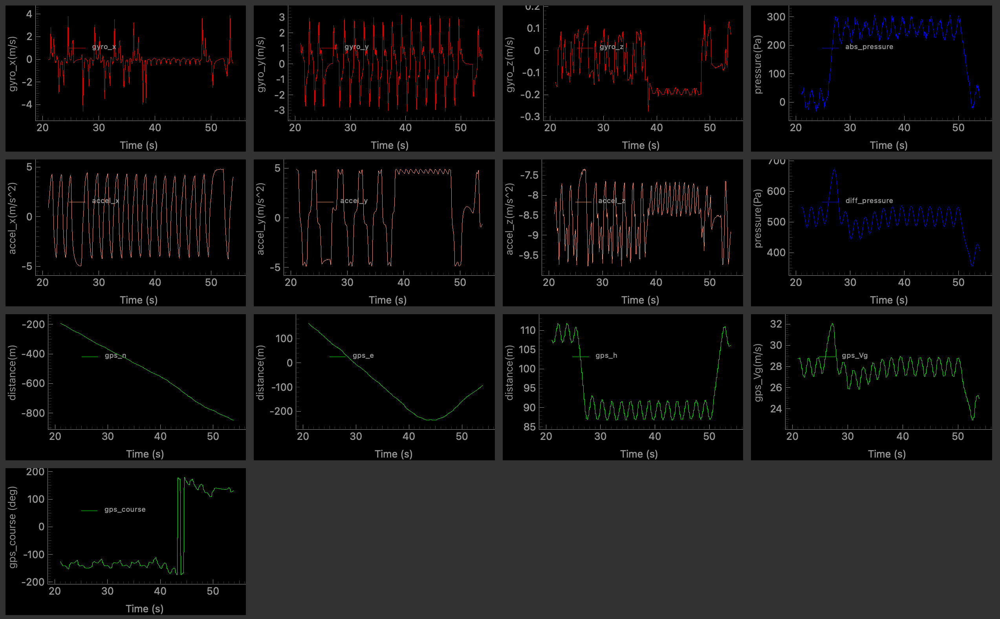

### Summary: What the Plane Is Doing

The MAV is responding to oscillating commands in **airspeed**, **altitude**, and **course**, and our sensor models are working correctly — each plot gives insights into that.

### 📈 Sensor Output for Chapter 7

Here is the sensor output plot for the MAV during simulation:



---

### 🔴 **Rate Gyros (Top Row, Red)**

- **gyro_x**, **gyro_y**, and **gyro_z** show periodic oscillations:
  - These reflect **roll**, **pitch**, and **yaw rates** as the MAV maneuvers.
  - The sharp transitions in `gyro_z` align with course changes starting at 5s.

---

### 🟠 **Accelerometers (Second Row, Orange)**

- All 3 axes respond to:
  - Translational accelerations from thrust and aerodynamic forces.
  - Gravitational effects (especially in `accel_z` which oscillates around ~-9.81 m/s²).
- The periodic nature reflects the up/down motion and oscillatory flight pattern.

---


### 🔵 **Pressure Sensors (Second Row, Right)**

- **abs_pressure** varies **inversely** with altitude. 
- **diff_pressure** tracks **airspeed** — consistent with the square wave signal applied to `Va`.

---

### 🟢 **GPS Measurements (Bottom Rows, Green)**

#### ➤ Position:

- **gps_n** and **gps_e** decrease steadily then curve — confirming the MAV is:
  - Flying **south** (as expected from course ≈ 180°).
  - Possibly turning eastward (evident from gps_e rising again).

#### ➤ **gps_h**:
- Oscillates between **~90 m to 110 m** = ✅ correct behavior!  
  The MAV is climbing and descending based on the `altitude_command`.

#### ➤ **gps_Vg**:
- Matches commanded airspeed: fluctuating around `25 m/s` with oscillations.
- Shows good tracking and sensor realism (noise included).

#### ➤ **gps_course**:
- At first, hovers around `180°` (south).
- Then begins abrupt shifts after `t = 40s`, matching your course square wave starting at `5s` with increasing frequency.


**Course input command:**

```python
course_command = Signals(dc_offset=np.radians(180),
                         amplitude=np.radians(45),
                         start_time=5.0,
                         frequency=0.015)
```
This creates a **square wave** between:
- `180° + 45° = 225° → wrapped to -135°`
- `180° - 45° = 135°`


If you want to sweep between **180° and 45°**, set:

```python
course_command = Signals(dc_offset=np.radians(112.5),  # halfway between
                         amplitude=np.radians(67.5),   # (180 - 45) / 2
                         start_time=5.0,
                         frequency=0.015)
```

That’ll give you a square wave between **45° and 180°** exactly.
